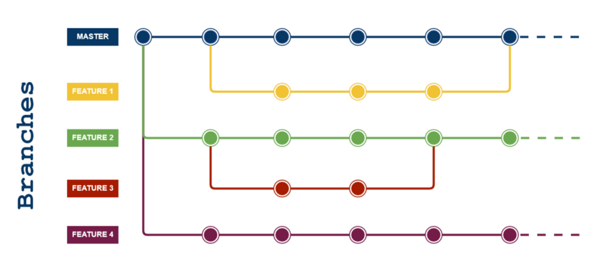

# Versioning-project---Tali---Cedric---Maxime

# Table des matières

1. [Info General](#info)
2. [Technologies](#technologies)
3. [WorkFlow](#workflow) 
4. [Commandes](#commandes)
5. [FAQs](#faqs)

# Info General

## Déploiement de l'application
L'application est déploiyée sur la plateforme Heroku à l'adresse suivante :

https://versioning-esgi.herokuapp.com/

## Procédure de développement d'une feature

- git pull sur main (pour mettre à jour sa branche main locale)

- création d'une nouvelle branche en dupliquant la main (donc Head doit être sur main): git checkout -b nom branch

- développement de feature (sur la branche nouvellement créée)

- git pull sur main (pour mettre à jour sa branche main locale)

- merge la main sur la branche feature pour résoudre les conflits (Head doit être sur feature branch): git merge main

- merge la branche feature (après conflit) sur la main (head sur main) : git merge

- Mettre à jour le tag de versions (majeur, mineur ou patch) : git tag -a < tag_name > -m "< message du tag >"
  - Si le tag ne s'est pas push : git push origin < tag_name >

Notes : on conserve la branche ayant servi à développer la feature pour des raisons scolaire, cela peut être cependant utile dans le cadre d'un projet, par exemple si l'on souhaite retirer une feature plus tard dans le projet.

## Template d'un commit

Format commit message :

type : TITRE COMMIT

message du commit

En commande : git commit -m "type : TITRE COMMIT" -m "message du commit"

Le détail du format a respecter est dans [.git-template.txt](.git-commit-template.txt)

# Technologies

## Déploiement HEROKU
Nous avons choisi d'utiliser Heroku, un service permettant le déploiement d'applications web. 

Grâce à Heroku, nous avons pu déployer notre projet qui contient du PHP sans trop de difficulté, le système choisi de base « http://netlify.com/ » ne permet pas de déployer un projet qui contient du PHP. 

# WorkFlow

## Feature Branch Workflow 
Le "Feature Branch Workflow" suppose un Repo principale Main ou l'on retrouve la version actuel ainsi que l'historique du projet. 

Au lieu de développer directement sur la branche master, les développeurs peuvent créer une nouvelle branche chaque fois qu'ils commencent à travailler sur une nouvelle fonctionnalité.

# Commandes

- git add \* (ou < filename >)
- git commit -m "< message >"
- git push
- git pull

### Gestion des fichiers

- git diff : voir les différentes modifications en cours
- git status : voir l'état des commit (en attente)
- git rm < filename > : supprime un fichier (effectif après le commit)
- git rm --cached < filename > : supprime les indexations d'un fichier
- git log : permet de visualiser l'historique des commits

## Gestion du git

- git rebase < branch > : va chercher l'ancêtre commun entre la branch spécifié et la HEAD et venir appliquer tous les commits de HEAD (à partir de ce point) à branch

### Les tags

- git tag -a < tagname > -m "< message du tag >" : permet de créer un tag annoté
- git push origin < tagname > : push la modification du tag (--tags pour tous les push)
- git tag -d < tagname > ou git push origin --delete < tagname > (pour push directement et delete en même temps)

### Les branchs

- git branch : affiche liste des branchs ou en créer une si on lui ajoute un nom
- git checkout < branch > : changer de branch
- git checkout -b < branch > / git switch -c < branch >: créer une nouvelle branch et switch dessus
- git merge (utiliser sur la branch sur laquelle on souhaite ramener le merge)
- git branch -d (-D pour forcer delete) < branch > : supprime branch

## Infos du git

- git ls-remote : liste des références (distantes), une référence désigne des éléments du dépôt distant (branch, tag, évènements...)
- git log --oneline --decorate --graph --all
- git fetch < remote > (ou < remote > < branch >) : Fetche toutes les branches du dépôt. Télécharge également tous les commits et fichiers nécessaires depuis l'autre dépôt.

## Infos complémentaires

- Syntaxe de version : majeur.mineur.patch (ex 3.2.0)

# FAQs

## Pourquoi le générateur de mot de passe ne fonctionne pas sur Heroku ?
 
Suite à un conflict entre AJAX et Heroku, le générateur de mot de passe ne fonctionne pas à ce jour, pour tester la Feature vous pouvez télécharger le projet et le lancer sur un serveur local.

